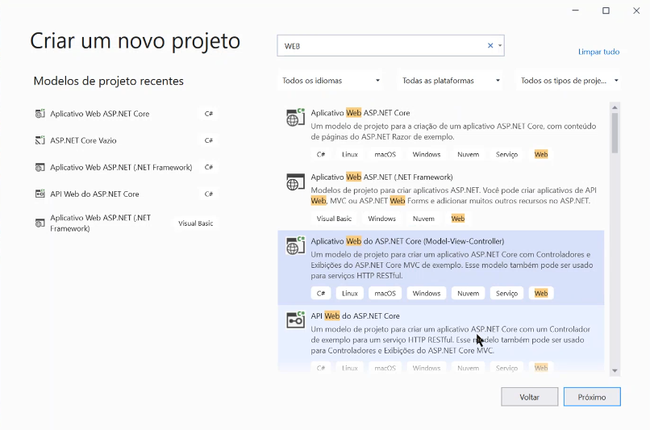

# Asp.Net Core MVC  - DBFirst

## Primeiro Passo

- A Manipulação do Banco de Dados no SQL Server:

```sql
CREATE DATABASE [SYSTEMAPPWEB]
GO
USE [SYSTEMAPPWEB]
GO
CREATE TABLE [dbo].[PRODUTOS]
(
		[ID_PRODUTO] INTEGER  PRIMARY KEY IDENTITY(1,1),
		[NOME] VARCHAR(40) NOT NULL,
   		[DESCRICAO] VARCHAR(250) NOT NULL,
	  	[QUANTIDADE] INTEGER NOT NULL,
		[PRECO] [DECIMAL](10,2) NOT NULL
)
```

---

## Segundo Passo

- Criação do Projeto no Visual Studio:




---

## Terceiro Passo:

- Criar a Conexão com o Banco de Dados no Visual Studio:


- Depois de realizar os passos acima a Conexão já estará criada:


---

## Próximo Passo Será colocar a string de conexão

- Será utilizado o arquivo appsettings.json

```json
{
  "ConnectionStrings": {
    "DefaultString": "Data Source=.\\SQLExpress;Initial Catalog=SISTEMAWEB;Integrated Security=True"
  },

  "Logging": {
    "LogLevel": {
      "Default": "Information",
      "Microsoft": "Warning",
      "Microsoft.Hosting.Lifetime": "Information"
    }
  },
  "AllowedHosts": "*"
}
```

---

## Próximo Passo será a instalação dos pacotes


### Pacotes que serão instalados:

- Microsoft.AspNetCore.Mvc.Razor.RunTimeCompilation
- Microsoft.EntityFrameworkCore
- Microsoft.EntityFrameworkCore.Design
- Microsoft.EntityFrameworkCore.Sql
- Microsoft.EntityFrameworkCore.Tools

---

## O Próximo passo é a criação do Scaffold, que é o recurso do visual studio que cria varios controladores

- Para isso terá que ser digitado os comando abaixos no terminal do visual studio:

```powershell
PM> cd nomedoprojeto
PM> Scaffold-dbContext "Data Source=.\SQLExpress;Initial 
Catalog=SISTEMAWEB;Integrated Security=True" Microsoft.EntityFrameworkCore.SqlServer 
-OutputDir Models
```


- Após Rodar este comando, será gerado a model do banco de dados criado.

---

## Próximo Passo será incluir os Uses do projeto, no arquivo startup.cs

```csharp
using Microsoft.EntityFrameworkCore;
using Microsoft.EntityFrameworkCore.SqlServer;
using SistemaWeb.Models;
```

### Tambem será incluido uma configuração neste mesmo arquivo

- Na Função ConfigureServices(), será incluido a string de conexão

```csharp
services.AddDbContext<SISTEMAWEBContext>(options =>
                options.UseSqlServer(Configuration.GetConnectionString("DefaultString"))
);
```

---

## Agora Iremos Criar Um Novo Controller


- No Arquivo da Controller, pode ser adionado as validações para os construtores

```csharp
//ESSAS ANOTAÇÕES SÃO COLOCADAS ACIMA DE CADA ATRIBUTO QUE É NECESSITA
[DataType(DataType.tipododado)] //anotação para tipos de dados diferentes
[Key] //anotação para identificar a chave primária
[Required(ErrorMessage = 'mensagem')] //indentifica os atributos como não nulos
[Range 1, 10] //Determina o Lenght do Campo
[Display (Name = 'Nome Que Irá aparecer na tela')]
```

- Exemplo de Como Usar as Validações:

```csharp
namespace SistemaWeb.Models
{
    public partial class Produto
    {
        [Key]
        public int IdProduto { get; set; }

        [Display (Name = "Nome do Produto")]
        [Required (ErrorMessage ="Campo obrigatório!")]
        public string Nome { get; set; }

        [Display(Name = "Descrição")]
        public string Descricao { get; set; }

        [Display(Name = "Quantidade")]
        [Required(ErrorMessage = "Campo obrigatório!")]
        public int Quantidade { get; set; }

        [Display(Name = "Preço")]
        [Required(ErrorMessage = "Campo obrigatório!")]
        public decimal Preco { get; set; }
    }
}
```

- Tambem será incluido no uses na model:

```csharp
using System.ComponentModel.DataAnnotations;
using System.ComponentModel.DataAnnotations.Schema;
#nullable disable
```

## Após Todas Estás Etapas, Seu Crud MVC DBFirst Estará Pronto.
